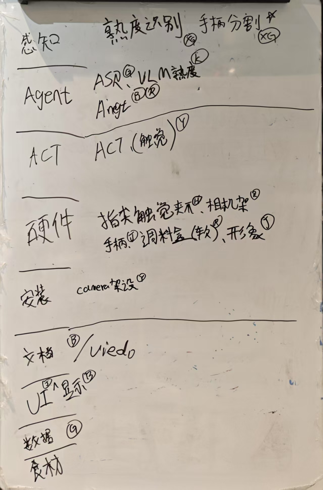

# SeedHackathon-WXJ-BBQRobot
BBQRobot Project using LeRobot for SeedHackathon SZ 2025, by WXJ team.

# 项目说明
这是一个使用LeRobot的BBQ机器人项目，由瓦香鸡小队开发。

## 项目背景
Seed Hackathon SZ 2025 是一个为期两天的黑客马拉松活动，是使用LeRobot进行项目开发。
主赛场项目文档如下：
[深圳站Hackathon文档](./深圳站Hackathon文档.pdf)
* 应用创新方向可以根据上述教程在特定的领域实现应用及部署，也可以加入  reSpeaker 语音模块、reCamera AI 摄像头模块完成创新任务，并产出文档及视频介绍，训练时的道具需要自带。
* 过程创新方向可以根据上述某一个过程提出自己的优化方案并实现出来，目的是降低用户 端到端某个环节的技术及成本门槛，例如手柄、Isaac sim、深度相机提高数据采集的效率
* 算法创新方向可以根据算法进行优化，例如引入深度相机的深度数据到算法中。
* 边缘端部署：结合  reComputer Jetson 边缘计算机
* 保证项目输出的完整性：项目完成 ＝  能输出一套完整的  可以让其他开发者伙伴复现的参考项目文档：包括 但不限于文档、GitHub 仓库、记录开发过程中每个步骤的视频，等...

## 项目目标
我们基于上述背景，结合我们小队的实际情况，决定开发一个BBQ机器人：使用LeRobot实现烤串BBQ，包括烤串的上炉 -》翻面 -》撒料 -》下炉装盘。

## 项目架构
### 初版架构图及分工说明

### 架构图
#### 感知层
感知层主要由传感器组成，功能包括：深度摄像机提供烤串的成熟度识别、烤签手柄位置分割，提供两个视角：顶视角和LeRobot末端视角。
* 模块1： 识别烤串成熟度
    * input: 摄像机
        * RGB
        * 视角：顶视角
        * 型号（）
        * 分辨率（）
        * 帧率（）
    * output: 烤串成熟度：
        * 0-4
    * 技术选型：VLM / YoloV11

* 模块2： 分割烤签手柄位置
    * input: 深度摄像机
        * RGBD
        * 视角：LeRobot末端视角
        * 型号（）
        * 分辨率（）
        * 帧率（）
    * output: 烤签手柄位置
    * 技术选型：YoloV8

#### 决策层
* Input：烤串成熟度、语音指令
* Output：烤串翻面、撒料、下炉装盘的指令
* 技术选型：LLM + 状态机

#### 执行层
* Input：烤串翻面、撒料、下炉装盘的指令、RGBD图像、触觉传感器
* Output：烤串翻面、撒料、下炉装盘的LeRobot动作
* 技术选型： ACT、DP

## 项目实现
### 工程Pipeline
#### 算法部分
1. 烤串成熟度识别

| 对比项目 | VLM直接输出 | YoloV8训练 |
|---------|------------|------------|
| 数据集准备 | 无 | 5Class * 100 |
| Input | RGB图像 | RGB图像 |
| Output | 0-4 | 0-4 |
| 技术选型 | VLM | YoloV11 |

2. 烤签手柄位置分割

#### 工程部分
1. 硬件准备
* LeRobot（已Ready）
* 顶部深度摄像机固定器（顶视图）
* 末端深度摄像机固定器（末端视角）
* 触觉传感器固定器（LeRobot原夹爪改造）
* 烤签手柄
* 调料盒（软质材料罐）
* 机器人形象（烧烤Master）

2. 软件准备
* 感知模块
* 决策模块
* 执行模块

3. 其他准备
* 炉具：电炉
* 食材：小串、大串
* 调料：辣椒粉、孜然粉、盐、食用油

#### 项目支持及文档
* 项目Wiki
* 项目Github
* 项目视频

####
